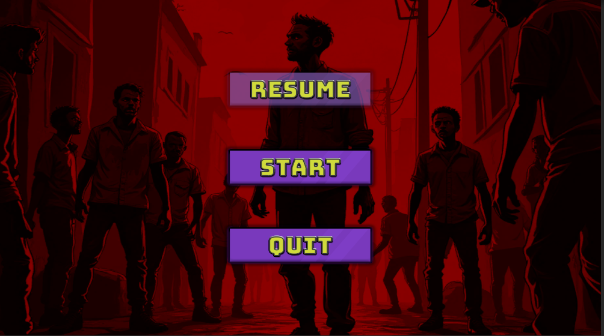
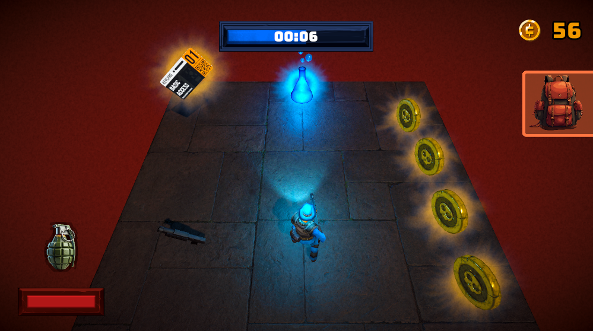
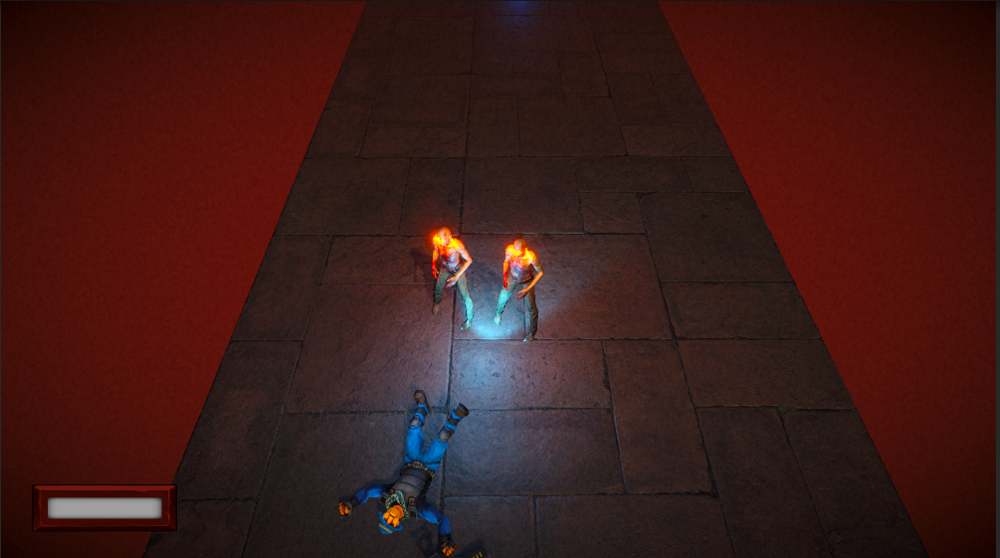
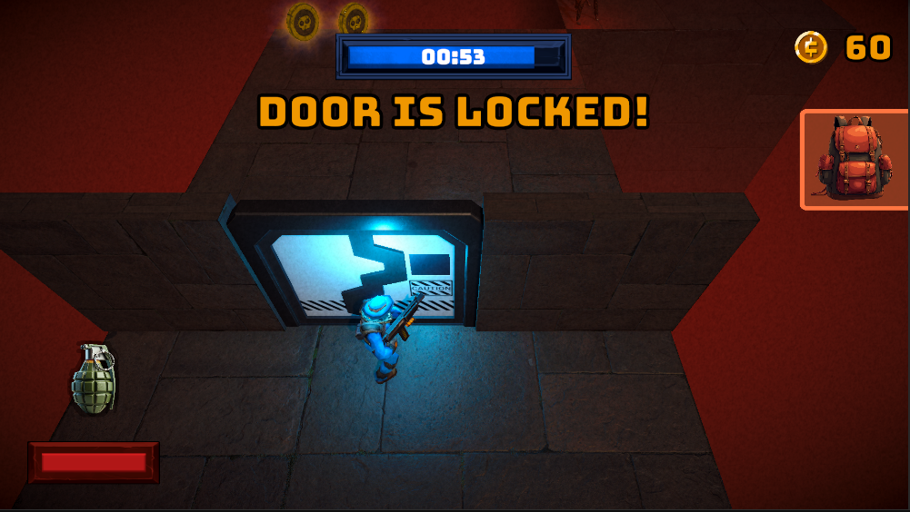
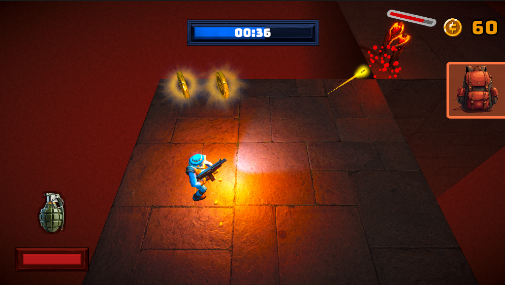
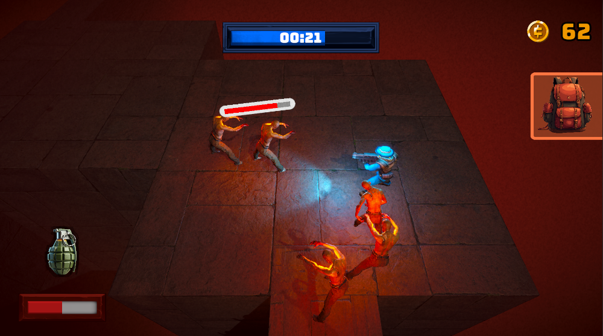
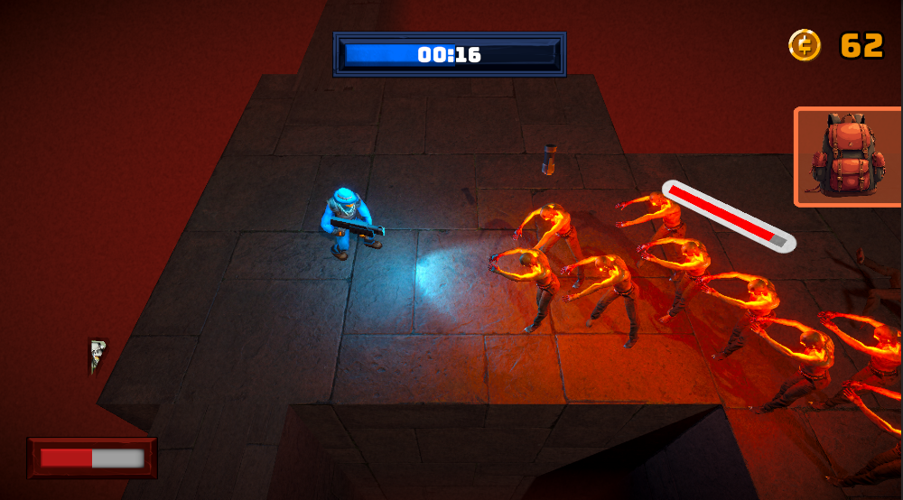

# 🧟‍♂️ Zombie Hunters

Genre: Third-Person Shooter (TPS)  
Engine: Unity  
Role: Solo Developer (Design + Code + Level Design)

## 🎯 Overview

Zombie Hunters is a level-based third-person shooter where the player must survive against waves of zombies under time pressure.  
The focus is on responsive player control, readable enemy behaviour, and a clear difficulty ramp.

## 🕹️ Core Features

- Third-person player controller
  - Smooth movement, aiming, and shooting
  - Camera tailored for mobile/PC TPS gameplay

  -Combat feedback
  - Muzzle flash and impact **particle effects**
  - Sound effects for shooting, hits, and zombie attacks
  - Clear visual indication when the player is damaged

  -Zombie AI
  - Basic state logic: idle → detect → chase → attack
  - Zombies navigate toward the player and attack in melee range
  - Scalable AI for multiple zombies at once

  Level & difficulty design
  - Timer-based levels to create urgency
  - Increasing difficulty via spawn rate, enemy count, and level layout
  - Room for future expansion with additional enemy types and objectives

## 🧩 Design Responsibilities

- Designed and implemented the player controller and shooting system  
- Prototyped and tuned AI behaviour for zombies  
- Created timer-based level structure with increasing difficulty  
- Built and iterated on level layouts for pacing and challenge

## 🛠️ Tech & Tools

- Unity (C#)
- NavMesh-based AI movement
- Particle systems, AudioSource / SFX cues
- Git & GitHub

## 📸 Screenshots

Main Menu

In-Game Collectibles

Dead Character

Implemented Mechanics

Firing&Visuals

Combat

